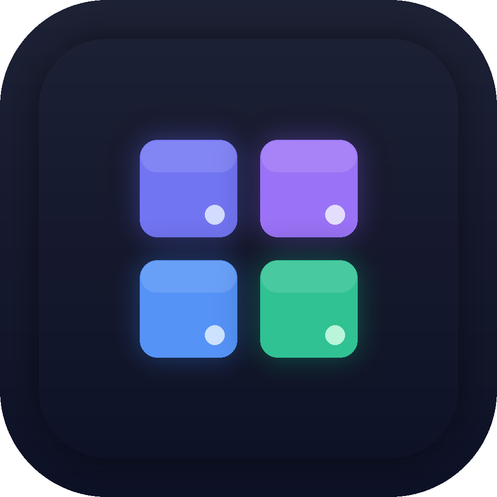

<div align="center">
  
  <h1>devkit</h1>
  <p><strong>Every app your AI builds, tracked.</strong></p>
  <p>A macOS menu bar app for developers who ship too many things.</p>

  <p>
    
    
    
    
    
  </p>

  
</div>

---

## What is devkit?

You use Claude Code, Cursor, or Codex to build apps. You now have 12 local projects. Half are on random ports. You don't know which ones are running.

devkit fixes this.

Add one line to your AI agent's config and every app it builds automatically registers itself — getting a clean `.localhost` URL and appearing in your menu bar with real-time status.

```
nova.localhost      🟢 running
forge.localhost     🟢 running  
orbit.localhost     🔴 stopped
beacon.localhost    🟢 running
```

No config per project. No remembering ports. No terminal tab soup.

---

## Quick Start

### 1. Install

```bash
# via Homebrew (installs CLI + Mac app)
brew tap djadmin/tap
brew install --cask devkit

# or build from source
git clone https://github.com/djadmin/devkit
cd devkit/MenuBarApp
./setup.sh
open DevkitBar.xcodeproj
```

### 2. Register your first app

```bash
devkit register my-api --port 3000 --cmd "npm run dev"
```

### 3. Set up your AI agent (one-time global setup)

Add the snippet for your agent — every app it builds will auto-register from now on. See **[Agent Setup →](docs/agent-setup.md)**

---

## Agent Setup

This is devkit's core feature. One config line → every AI-built project auto-registers.

### Claude Code

Add to `~/.claude/CLAUDE.md` (global) or `CLAUDE.md` in any project:

```markdown
## devkit — App Registration

After creating any web application or local service, register it:

```bash
devkit register <app-name> --port <port> --cmd "<start-command>"
```

- Use lowercase-hyphenated names (e.g. my-api, auth-service)
- Run after the project structure exists, not before
- Skip if devkit is not installed: check with `which devkit`
```

### Cursor

Create `.cursor/rules/devkit.mdc` in your project (or add to Cursor Settings → Rules for global):

```markdown
---
description: Register new web apps with devkit after creating them
alwaysApply: true
---

After creating any web application or service, run:
devkit register <app-name> --port <port> --cmd "<start-command>"
```

### OpenAI Codex

Add to `~/.codex/AGENTS.md` (global):

```markdown
## devkit — App Registration

After creating any web application or local service:
devkit register <app-name> --port <port> --cmd "<start-command>"
```

> Copy-paste ready snippets for all agents: [docs/agent-setup.md](docs/agent-setup.md)

---

## Features

- **Menu bar status** — see all registered apps and whether they're running at a glance
- **Start / stop** — control services directly from the menu bar
- **Search** — filter by name or hostname when you have many apps
- **Grouped sections** — running apps float to the top, stopped at the bottom
- **Bulk actions** — Start All / Stop All per section
- **Copy URL** — one click to copy the `.localhost` URL
- **Auto-focus search** — open the menu bar and start typing immediately
- **Agent-first** — built to work with Claude Code, Cursor, Codex out of the box
- **Local proxy** — every app gets a clean `appname.localhost` URL via devkit's proxy
- **File watching** — `apps.json` is watched; changes appear instantly without a reload
- **⌘R** — keyboard shortcut to reload the registry

---

## Supported Stacks

devkit tracks **any process that listens on a TCP port**. Framework and language don't matter.

| Stack | Example start command |
|---|---|
| Node / Next.js | `npm run dev` |
| Node / Express, Fastify | `node server.js` |
| Ruby on Rails | `rails server -p 3000` |
| Python / FastAPI | `uvicorn main:app --port 8000` |
| Python / Django | `python manage.py runserver 8000` |
| Go | `go run main.go` |
| Rust / Axum, Actix | `cargo run` |
| PHP / Laravel | `php artisan serve` |
| Java / Spring Boot | `./mvnw spring-boot:run` |
| .NET | `dotnet run` |
| Static / Vite | `vite --port 5173` |

If it has a port, devkit can track it. See [docs/supported-stacks.md](docs/supported-stacks.md) for full details.

---

## Requirements

- macOS 13 Ventura or later (Apple Silicon and Intel)
- [devkit CLI](https://github.com/djadmin/devkit) installed
- Xcode 16+ (to build from source)

---

## Project Structure

```
MenuBarApp/
├── DevkitBar/
│   ├── Models/          # AppEntry, AppStatus
│   ├── Services/        # AppRegistry, DevkitCLI, PortChecker
│   └── Views/           # MenuBarView, AppRowView, HeaderView, FooterView
├── docs/                # Documentation
├── project.yml          # XcodeGen project definition
└── setup.sh             # Bootstrap script
```

---

## FAQ

**Does devkit start apps automatically?**  
No. devkit registers and monitors apps. Starting is either manual (click ▶ in the menu bar) or handled by your agent/shell.

**Do I need to register every project manually?**  
Only once — after that your AI agent handles it automatically via `CLAUDE.md` / `AGENTS.md`.

**Does it work without the devkit CLI?**  
The menu bar app reads `apps.json` directly. As long as you have a valid `apps.json`, the app works.

**What's the difference between devkit and LocalCan?**  
LocalCan gives you pretty URLs and ngrok tunnels. devkit gives you control over your entire dev stack — start, stop, monitor, and share the configuration with your team. They solve adjacent problems.

**Is it open source?**  
Yes. MIT license. The core CLI and menu bar app are free forever.

> More in [docs/faq.md](docs/faq.md)

---

## Contributing

PRs welcome. Please open an issue first for anything beyond small bug fixes.

```bash
git clone https://github.com/djadmin/devkit
cd devkit/MenuBarApp
./setup.sh          # installs xcodegen, generates .xcodeproj
open DevkitBar.xcodeproj
```

---

## License

MIT © [Dheeraj Joshi](https://github.com/djadmin)
